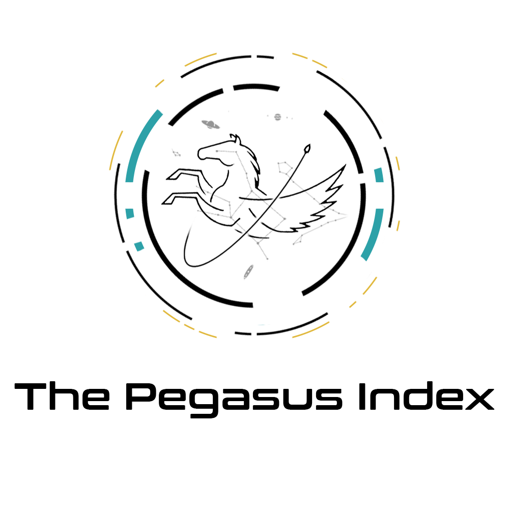
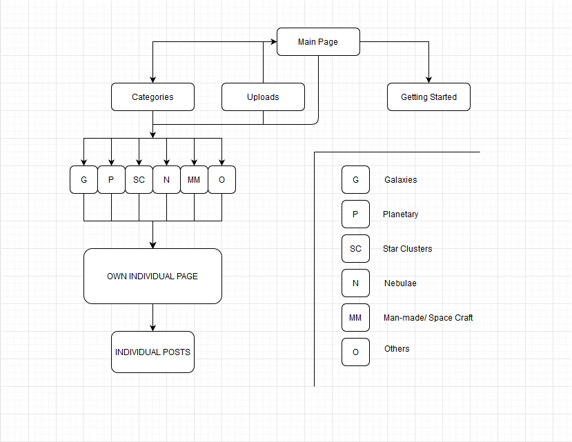

## A MERN stack with mongoDB project for Assignment 2
***

## **Context**
___
### _Opening Statement & Summary_
This assignment has required us, the programmers, to create an interactive website using a MERN(MongoDB, Express, React, Node) stack. Demonstrating my proficiency with the technologies.

This project that I've created, within the set requirements, is essentially a a website forum for Astrophotographers, to share what they have found, get involved in discussions with each other and share their personal knowledge on things they have learned during the process.

In talking about Space and its current age of technological advancements, its most recent success with Perseverance, the rover on Mars, and along with that, the constant successes with spaceX’s falcon 9 flights.

As more of these are coming on to the front page of social media, the general topic and interest has been gaining a lot of traction. One of the avenues is Astrophotography. Capturing images of space bodies millions of lightyears away from where we are standing. I wanted to create a portal that holds this avenue and give a collaboration space for amateurs and veteran astrophotographers alike. So this is what the basis of my project is about.

___
### _Personal goals and expected user goals_
What I, as the programmer, hope to achieve is to provide a focused portal for like-minded individuals to share and discuss topics around this hobby.

As the user, the goal is to have a place where I can share my findings, pictures and methods to other like-minded people in this hobby.
***
## Demo
___
The live website can be access from this link:
### [The Pegasus Index](https://vigilant-torvalds-eac850.netlify.app/)
***
## **Content**
___
### **Site Map**

### **Landing Page**
* Main landing page
* Category tab

### **Categories**
  * Galaxies
  * Planets
  * Stars
  * Nebulae
  * Man-made
  * Other

### **Individual post page**

### **Getting Started**
* Uploading your first post
* Getting started with astrophotography

### **Uploads**
* Upload post form

___
#### Landing page
The main logo along with the title will be the first thing user sees upon entering the page. Scrolling down, there will be a small content divider showing a small glimps on what the website is about. Further down, there is an interactive category list, displaying all 6 categories in image buttons.

#### Categories page
This constitutes all 6 categories as they are of the same layout.
Upon entering, you'll be greeted with the title of the respective category and a small description about it. A filter bar is present to filter only by title. The contents of all the posts will follow up under the filter bar. All posts will be displayed in cards, a preview of the photograph along with the title and the astrophotographer.

#### Individual post page

#### Getting Started page

#### Uploads page

#### Responsiveness
This website is meant to only be used on a computer system. Any monitor resolution above: 1366 x 786
#### Navigation

***
## UI and Design Choices
___
#### **Space/modern themed. Around a main focus**

#### **Color choices and Fonts**

***

## Testing
___
### _Markup Validations_
HTML page validated using W3 validator
#### index.html
4 errors - missing alt tag on area map
No other significant errors
#### highscore.html
No significant errors alerted
#### Gameplay.html (all 4 included)
No significant errors alerted
___
### _Console.log Checks_
Axios check - "Database Active, Returning test value:"

Score check - Every time user clicks on the correct answer, "ScoreUp 1++"
***
## Technologies Used
___
As with the requirements of this project, it is done within the limits of **MongoDB, Express, React, Node**.
All coding has been done in **Gitpod** IDE, including a seperate repository as a testing workbench.

**I also employed the use of external frameworks such as:**

#### **REACT Bootstrap in 2 kinds** https://react-bootstrap.github.io/ & https://mdbootstrap.com/

#### **Axios** https://github.com/axios/axios

**Tools involved during development:**

#### **Drawio** https://app.diagrams.net/
Using Drawio for my Site map

#### **Photoshop** https://www.photoshop.com/en
All graphics have been done photoshop

#### **DAFONT** https://www.dafont.com/
Fonts that are in the game was found and downloaded here

#### **Dirty Markup** https://www.10bestdesign.com/dirtymarkup/
Cleaning up codes

#### **w3 Markup Validator** http://validator.w3.org/
Markup Validations
***

## Future development plans and Existing Bugs
___

***
## Deployment
___
### Content
* Ensure all last changes are saved and committed
* Successfully went through with a Git Push

### Activate Deployment
1. On GitHub, navigate to your site's repository.
2. Under your repository name, click Settings
3. Under "GitHub Pages", use the None or Branch drop-down menu and select a publishing source.
Drop-down menu to select a publishing source
4. Optionally, use the drop-down menu to select a folder for your publishing source.
5. Click Save.

***
## Credits
___

